# Message Exchange Sequence Diagrams

This document contains comprehensive sequence diagrams for the distributed broker system, illustrating all major message exchange patterns and communication flows.

## Table of Contents

1. [Client Cluster Discovery Flow](#1-client-cluster-discovery-flow)
2. [Write Operation with Replication](#2-write-operation-with-replication)
3. [Read Operation Flow](#3-read-operation-flow)
4. [Broker Join Cluster Process](#4-broker-join-cluster-process)
5. [Leader Election Process](#5-leader-election-process)
6. [Heartbeat Monitoring and Failure Detection](#6-heartbeat-monitoring-and-failure-detection)
7. [Complete System Overview](#7-complete-system-overview)

---

## 1. Client Cluster Discovery Flow

Shows how clients discover cluster topology and establish connections to brokers.

**Key Messages:**
- `CLUSTER_QUERY`: Client requests cluster topology
- Response includes all broker information, roles, and network addresses
- Client establishes connections based on discovered topology

---

## 2. Write Operation with Replication

Demonstrates the complete write operation flow including replication and consensus.

**Key Messages:**
- `APPEND` / `CREATE_QUEUE`: Client write operations
- `REPLICATE`: Leader-to-replica data synchronization
- Majority consensus required for commit
- Strong consistency guarantees

---

## 3. Read Operation Flow

Shows how clients read messages with position tracking and consistency guarantees.

**Key Messages:**
- `READ`: Client read request
- Leader-only operations for strong consistency
- Per-client position tracking
- Position updates replicated to replicas

---

## 4. Broker Join Cluster Process

Illustrates how new brokers join an existing cluster and receive initial state.

```mermaid
sequenceDiagram
    participant NewBroker as New Broker
    participant SeedBroker as Seed Broker
    participant Leader as Leader Broker
    participant Replica1 as Existing Replica 1
    participant Replica2 as Existing Replica 2

    Note over NewBroker, Replica2: Broker Join Cluster Process

    NewBroker->>SeedBroker: 1. Contact seed broker for discovery
    SeedBroker->>NewBroker: 2. Current leader information
    
    NewBroker->>Leader: 3. JOIN_CLUSTER request<br/>{"operation": "JOIN_CLUSTER", "broker_id": "B-NEW001", "host": "127.0.0.1", "port": 9403, "cluster_id": "G-XYZ789"}
    
    Note over Leader: Validate cluster_id and<br/>assign replica role
    
    Leader->>NewBroker: 4. Join response with cluster state<br/>{"status": "success", "cluster_info": {...}, "data_snapshot": {...}}
    
    Note over NewBroker: New broker receives:<br/>- Complete cluster member list<br/>- All queue data and messages<br/>- Client read positions
    
    par Membership Update to All Brokers
        Leader->>Replica1: 5a. CLUSTER_UPDATE<br/>{"operation": "CLUSTER_UPDATE", "cluster_version": 44, "members": {...}}
        Leader->>Replica2: 5b. CLUSTER_UPDATE<br/>{"operation": "CLUSTER_UPDATE", "cluster_version": 44, "members": {...}}
        Leader->>NewBroker: 5c. CLUSTER_UPDATE<br/>{"operation": "CLUSTER_UPDATE", "cluster_version": 44, "members": {...}}
    end
    
    par ACK from All Brokers
        Replica1->>Leader: 6a. {"status": "success"}
        Replica2->>Leader: 6b. {"status": "success"}
        NewBroker->>Leader: 6c. {"status": "success"}
    end
    
    Note over NewBroker, Replica2: New broker is now active replica<br/>receiving heartbeats and replication
```

**Key Messages:**
- `JOIN_CLUSTER`: New broker requests cluster membership
- Complete data snapshot transfer
- `CLUSTER_UPDATE`: Cluster-wide membership synchronization
- Dynamic cluster membership management

---

## 5. Leader Election Process

Shows the complete leader election flow when a leader fails.

**Key Messages:**
- `ELECTION_REQUEST`: Candidate requests votes from replicas
- Vote validation and consensus
- `PROMOTE_TO_LEADER`: New leader announcement
- Automatic failover and recovery

---

## 6. Heartbeat Monitoring and Failure Detection

Demonstrates the heartbeat mechanism and how failures are detected and handled.

**Key Messages:**
- `HEARTBEAT`: Periodic health check messages
- Timeout-based failure detection
- `CLUSTER_UPDATE`: Failed broker exclusion
- Automatic cluster healing

---

## 7. Complete System Overview

Comprehensive diagram showing the interaction of all major system components and message flows.

---

## Message Exchange Summary

### Client ↔ Broker Messages
| Message | Purpose | Direction |
|---------|---------|-----------|
| `CLUSTER_QUERY` | Discover cluster topology | Client → Broker |
| `CREATE_QUEUE` | Create new queue | Client → Leader |
| `APPEND` | Add message to queue | Client → Leader |
| `READ` | Read next message | Client → Leader |

### Broker ↔ Broker Messages
| Message | Purpose | Direction |
|---------|---------|-----------|
| `JOIN_CLUSTER` | Join existing cluster | New Broker → Leader |
| `HEARTBEAT` | Health check | All Brokers → Leader |
| `REPLICATE` | Data replication | Leader → Replicas |
| `ELECTION_REQUEST` | Request votes for leadership | Candidate → Replicas |
| `PROMOTE_TO_LEADER` | Announce new leader | New Leader → All |
| `CLUSTER_UPDATE` | Update cluster membership | Leader → All |
| `DATA_SYNC_REQUEST` | Request data synchronization | Broker → Leader |

### System Characteristics
- **Strong Consistency**: All operations coordinated through leaders
- **Fault Tolerance**: Majority consensus for all write operations
- **Automatic Recovery**: Leader election and failure detection
- **Load Balancing**: Multiple leaders for horizontal scaling
- **Dynamic Membership**: Brokers can join/leave at runtime

---

*Generated from the distributed broker system message exchange analysis*
