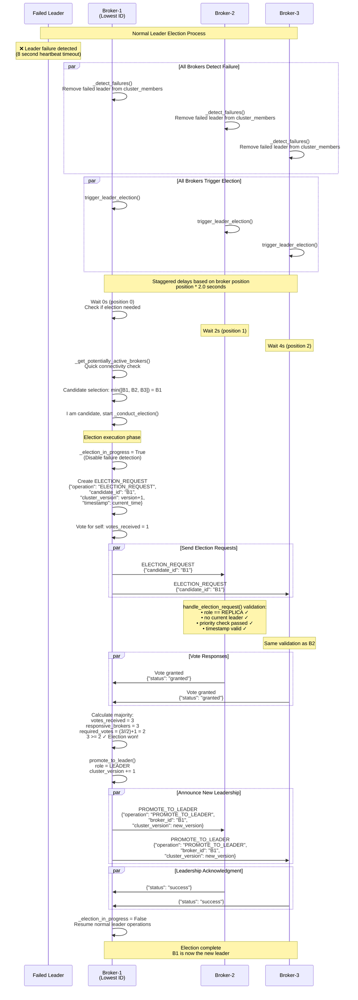
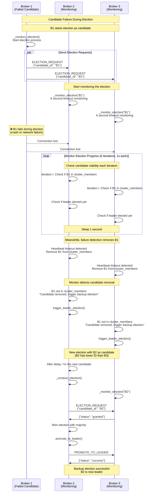
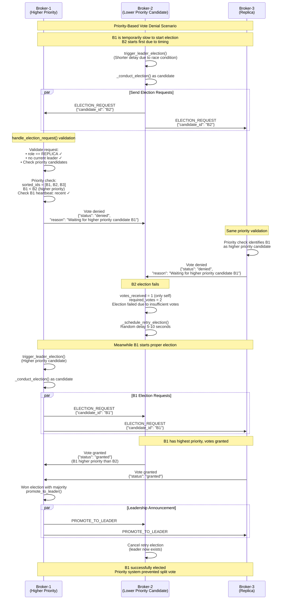
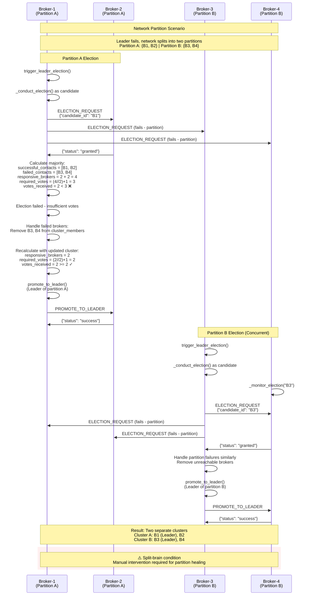
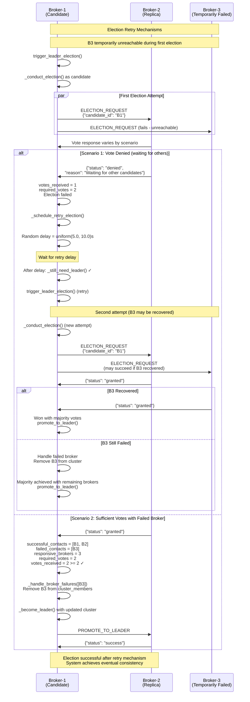

# Leader Election Process - Sequence Diagrams

This document contains detailed sequence diagrams for the leader election process and failure handling scenarios in the distributed broker system, based on the implementation in `leader_election.py` and `cluster_manager.py`.

## Table of Contents

1. [Normal Leader Election Process](#1-normal-leader-election-process)
2. [Candidate Failure During Election](#2-candidate-failure-during-election)
3. [Priority-Based Vote Denial](#3-priority-based-vote-denial)
4. [Network Partition Scenarios](#4-network-partition-scenarios)
5. [Election Retry Mechanisms](#5-election-retry-mechanisms)

---

## 1. Normal Leader Election Process

Shows the complete leader election flow when a leader fails, including staggered delays and candidate selection.

**Key Messages:**
- `ELECTION_REQUEST`: Candidate requests votes from replicas
- Vote validation includes priority checks and timeouts
- `PROMOTE_TO_LEADER`: New leader announcement to all brokers
- Staggered delays prevent election storms

---

## 2. Candidate Failure During Election

Demonstrates how the system handles candidate failures and triggers backup elections.

**Key Messages:**
- Election monitoring prevents indefinite waits
- Failed candidates automatically removed from cluster
- Backup elections triggered by monitoring timeouts
- System self-heals without manual intervention

---

## 3. Priority-Based Vote Denial

Shows how the priority system prevents split votes and ensures deterministic leader selection.

**Key Messages:**
- Priority system uses lexicographic broker ID ordering
- Lower ID brokers have higher priority for leadership
- Recent heartbeat check (12 second window) validates candidate viability
- Failed elections automatically retry with exponential backoff

---

## 4. Network Partition Scenarios

Illustrates how the system behaves during network partitions and majority requirements.

**Key Messages:**
- Majority calculation initially includes all known brokers
- Failed brokers removed from cluster during election
- Each partition can elect its own leader
- Split-brain detection requires external coordination

---

## 5. Election Retry Mechanisms

Shows how failed elections are retried and eventual consistency is achieved.

**Key Messages:**
- `_schedule_retry_election()`: Random backoff prevents election storms
- `_still_need_leader()`: Validates retry necessity before new election
- Failed brokers automatically removed during election process
- Retry mechanism ensures eventual leader selection

---

## Message Exchange Summary

### Election-Specific Messages
| Message | Purpose | Direction | Key Fields |
|---------|---------|-----------|------------|
| `ELECTION_REQUEST` | Request votes for leadership | Candidate → Replicas | candidate_id, cluster_version, timestamp |
| Vote Response | Grant or deny vote | Replica → Candidate | status: "granted"/"denied", reason |
| `PROMOTE_TO_LEADER` | Announce new leader | New Leader → All | broker_id, cluster_version |

### Election Characteristics
- **Priority-Based**: Lower broker IDs have election priority
- **Majority Consensus**: Requires (responsive_brokers // 2) + 1 votes
- **Failure Resilient**: Automatic retry with exponential backoff
- **Split-Brain Prevention**: Majority requirements prevent dual leadership
- **Monitoring**: Non-candidates monitor election progress with timeouts
- **Staggered Timing**: Position-based delays prevent election storms

### Timing Parameters
- **Election Cooldown**: 5 seconds minimum between elections
- **Staggered Delays**: position × 2.0 seconds
- **Vote Timeout**: 15 seconds maximum for election requests  
- **Vote Cooldown**: 3 seconds minimum between votes
- **Monitor Timeout**: 6 seconds for candidate monitoring
- **Retry Delay**: Random 5-10 seconds for failed elections

---

*Generated from the leader election system implementation analysis*